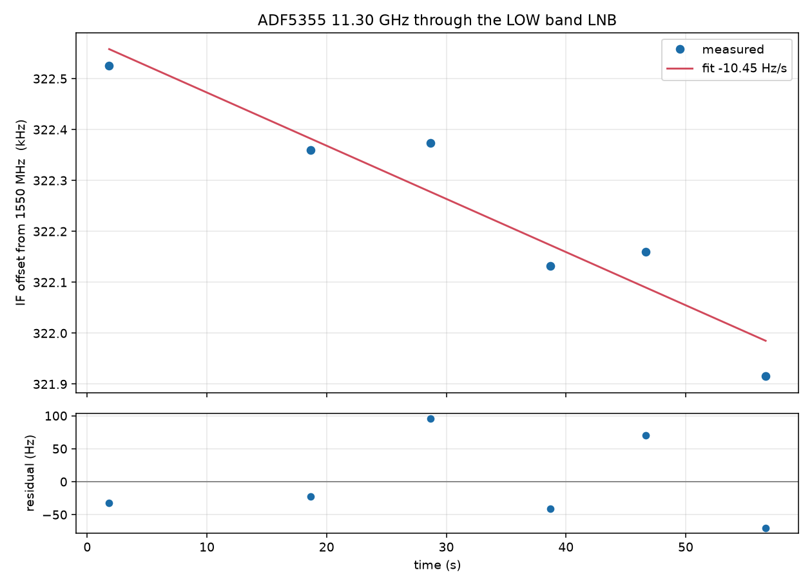
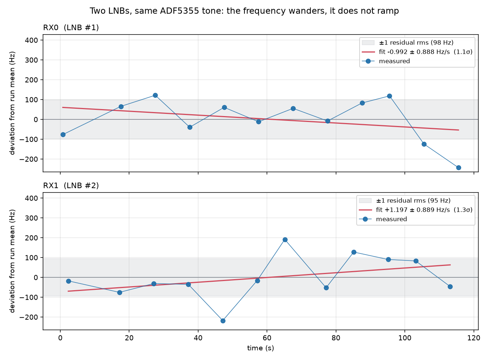

# Dual-tone LNB band identification

> **⚠️ Closed, conducted path only.** 10.7–12.75 GHz is satellite downlink
> spectrum. Coax into an attenuator and a load, or a shielded enclosure. Do not
> connect an antenna to either end.

Two tones, one per LNB band, alternating one second each. Which one survives
tells you which local oscillator the LNB is running — and the surviving tone
then measures the clock offset. The transmitter is the ADF5355 driven from C;
the receiver is a PlutoSDR taking single-shot captures.

```
   ADF5355  ──RF──▶  LNB  ──IF──▶  PlutoSDR RX1
   11.30 / 12.20     LO 9.75 or       2.5 MS/s
   GHz, 1 s each     10.6 GHz         4 s single shot
                     (which one?)
```

## The problem

A universal LNB has two LOs, 9.75 GHz (low band) and 10.6 GHz (high band),
selected by a 22 kHz tone on the coax and readable back from nothing at all.
The 13 V/18 V supply selects *polarisation*, not band, so the voltage tells you
nothing either.

You cannot infer the band from the IF, because the LNB's LO is free-running with
of order 100 kHz of error — measured here at **+94 kHz** — and either LO can
explain any given IF. An observed 1550 MHz is consistent with 11.30 GHz through
the 9.75 LO or 12.15 GHz through the 10.6 LO, and no amount of precision
separates those two stories.

## The idea: let the LNB's output filter answer

The LNB only outputs 950–2150 MHz. Pick two RF tones such that **exactly one
survives the filter under each hypothesis**:

| RF tone | via LO 9.75 (low) | via LO 10.6 (high) | survives when |
|---|---|---|---|
| **11.30 GHz** | IF **1550 MHz** ✅ | IF 700 MHz ❌ *(250 MHz below the 950 edge)* | low band |
| **12.20 GHz** | IF 2450 MHz ❌ *(300 MHz above the 2150 edge)* | IF **1600 MHz** ✅ | high band |

That turns "which frequency is closer to prediction", which the LO error makes
unanswerable, into a **presence/absence test**, which the LO error cannot reach:
the discrimination margin is 250–300 MHz against an error of 100 kHz, about
2500× more headroom than the failure mode needs.

Measured on this bench: **68.1 dB against 32.0 dB, a 36.1 dB margin.** Not a
close call.

### Choosing the tone pair

Any pair satisfying both constraints works. Writing `f_lo` for the tone that
should survive only the low band and `f_hi` for the other:

```
    f_lo − 9.75  ∈ [0.95, 2.15]  and  f_lo − 10.6 < 0.95   →  f_lo ∈ [10.70, 11.55)
    f_hi − 10.6  ∈ [0.95, 2.15]  and  f_hi −  9.75 > 2.15  →  f_hi ∈ (11.90, 12.75]
```

11.30 and 12.20 GHz sit 250 and 300 MHz inside those boundaries, which is the
margin quoted above. Both are legal ADF5355 outputs on RFoutB: `RFoutB = 2×VCO`
puts them at VCO 5.65 and 6.10 GHz, inside the 3.4–6.8 GHz range.

`tools/lnb_band_id.py` refuses a pair that fails either constraint before it
captures anything:

```
$ tools/lnb_band_id.py --low-rf-ghz 11.30 --high-rf-ghz 11.80
       RF GHz    via LO 9.75    via LO 10.6   decides
    ------------------------------------------------------------
       11.300     1550 MHz        700 MHz x   LOW
       11.800     2050 MHz       1200 MHz     HIGH

  REFUSING: 11.800 GHz also lands in band under the other LO (2050 MHz):
            it survives either way and decides nothing
```

## Emitting it — the C transmitter

### 1. Generate the plan

The divider arithmetic stays in Python so there is exactly one implementation of
it; the C program consumes the result. Two points, one second each:

```bash
python3 tools/emit_ladder_plan.py --out dual.bin \
    --freqs 11.30G,12.20G --dwells-ms 1000,1000 \
    --power 3 --channel B --autocal-every
```
```
dual.bin: 2 points, cycle 2000 ms, loops forever
    11.300000 GHz  hold 1000 ms
    12.200000 GHz  hold 1000 ms
```

That is a 124-byte file. Its contents, for the pair above:

```
  header   magic "AD57"  points 2  r6_on 0x35016036  r6_off 0x35016436
           delay_us 161  autocal_every 1  boot[13]
  point 0  R1 0x06666661  R2 0x5F5FB9A2  R0 0x001005A0  R0cal 0x003005A0  1000 ms
  point 1  R1 0x09999991  R2 0x8F0FB9A2  R0 0x00100610  R0cal 0x00300610  1000 ms
```

Those words are checkable by hand, which is the point of writing them down.
With `fPFD = 62.5 MHz` and `RFoutB = 2×VCO`:

```
  point 0   INT  = (0x001005A0 >> 4) & 0xFFFF   = 90
            FRAC1= (0x06666661 >> 4) & 0xFFFFFF = 0x666666 / 2^24 = 0.4
            VCO  = 62.5 MHz × 90.4 = 5.650 GHz  →  RFoutB = 11.300 GHz ✓
  point 1   INT  = 97, FRAC1 = 0x999999 / 2^24  = 0.6
            VCO  = 62.5 MHz × 97.6 = 6.100 GHz  →  RFoutB = 12.200 GHz ✓
```

### 2. Run it

```bash
gcc -O2 -Wall -Wextra -o dwell_ladder tools/dwell_ladder.c

# Clear any stale transmitter first. Match on the comm field, not on the whole
# command line: a pgrep -f pattern matches the shell running it, and the kill
# then takes out your own script.
for p in $(ps -eo pid,comm | awk '$2=="adf5355"||$2=="dwell_ladder"{print $1}')
do kill -9 "$p" 2>/dev/null; done

pinctrl set 23 op dh; sleep 0.3           # CE high — the ADF5355 chip enable
setsid nohup ./dwell_ladder dual.bin 20000000 /dev/spidev0.0 30 \
    > band.log 2>&1 < /dev/null & disown  # plan, SPI Hz, spidev, spin µs
```

It loops until signalled, writes `r6_off` on the way out, and prints a one-line
JSON summary to stderr. The shape of it, for this plan stopped after half an
hour:

```json
{"impl":"c-ladder","points":2,"held":1834,"elapsed_s":1834.02,"rt":1,"mlock":1,"autocal":1}
```

`"held"` should equal `elapsed_s` divided by the dwell, and `"autocal"` should
echo the flag the plan was emitted with — both are worth a glance, because a
plan file that is not the one you think it is looks like nothing else.
`"mlock":1` means the pages are locked. **`"rt":0` means it did not get
`SCHED_FIFO`** and is running at ordinary priority; that needs `CAP_SYS_NICE` or
root, and without it a loaded machine can stretch a dwell.

Stop it with `SIGTERM`, then `adf off` to be sure the outputs are down.

### 3. What the loop actually does

The whole transmitter is this, from `tools/dwell_ladder.c`:

```c
struct timespec st; clock_gettime(CLOCK_MONOTONIC, &st);
int64_t deadline = ns_of(&st);
uint64_t played = 0;

while (!stop_now){
    uint32_t p = (uint32_t)(played % points);   /* one period in memory,     */
    deadline += (int64_t)dw[p];                 /* indexed modulo — so run   */
    wait_until(deadline);                       /* length costs no memory    */

    uint32_t n = (uint32_t)((played+1) % points);
    const uint32_t *v = &w[n*4];
    wr(v[0]); wr(v[1]); wr(v[autocal_every?3:2]); /* R1, R2, then R0 latches */
    if (autocal_every) usleep(delay_us);
    played++;
}
wr(r6_off);                                     /* outputs down on the way out */
```

Four details carry weight:

**Absolute deadlines, not sleeps.** `deadline += dw[p]` accumulates from a single
`CLOCK_MONOTONIC` origin, so scheduling jitter on one dwell does not push every
later one. `wait_until` sleeps to within `spin_us` of the deadline and busy-waits
the rest, which is why the last argument is 30 µs.

**R0 last.** R1 and R2 stage the fractional and modulus values; writing R0 is
what latches the new frequency. The order is the protocol, not a preference.
With autocal on, the word written is `R0cal` — index 3 rather than 2 — and the
`usleep(delay_us)` after it is the band-select settle.

**Modulo indexing.** Only one period is ever in memory. The Python hopper this
replaced materialised `cycles × len(freqs)` objects — 400M of them, 1.05 GB RSS,
none of which reached the wire because the transmit call only ran after the list
was built. The C version holds **1792 kB, flat, forever.**

**Autocal runs on every hop here, and it has to.** `RFoutB = 2×VCO`, so the two
tones sit at VCO 5.650 and 6.100 GHz — a **450 MHz step** at every transition.
That crosses VCO bands, so the band select has to be redone or the synthesiser
lands off-band. `--autocal-every` is what puts the `1` in the header above; the C
loop then writes `R0cal` (bit 21 set) instead of `R0` and waits `delay_us`.

The cost is small. `delay_us` is 161 µs, derived as the 16 ADC clock cycles the
part needs to settle a band select — 16e6/161 ≈ 99.4 kHz ADC clock — which is
0.016% of a 1 s dwell. A short-dwell schedule inside one VCO band is where
turning autocal off is worth it; this is not that schedule.

Confirm lock at both tones before committing to a long run:

```bash
for F in 11.30 12.20; do
  adf5355 dwell --freq ${F}G --channel B --dwell 2 --power 3 --enable-rf \
    2>&1 | grep -E "achieved|locked|error" | sed "s/^/  ${F}G: /"
done
adf5355 off
```
```
  11.30G:   achieved 11.300000000 GHz  error -0.000098 Hz (-0.000 ppb)
  11.30G:   locked in 3.3 ms
  12.20G:   achieved 12.200000000 GHz  error +0.000098 Hz (+0.000 ppb)
  12.20G:   locked in 4.3 ms
```

Both tones land within 0.0001 Hz of nominal and lock in a few milliseconds, so a
1 s dwell spends 99.6% of itself locked. If either line is missing or the lock
time is tens of milliseconds, fix that before capturing anything.

## Listening — the SDR side

### Capture parameters, and why each one

| Setting | Value | Why |
|---|---|---|
| Sample rate | **2.5 MS/s** | Worst-case LNB error ±500 kHz must land inside the passband |
| Capture | **4 s single shot** | A whole dwell is only guaranteed when capture ≥ dwell + cycle = 3 s; 1 s of margin |
| Kernel buffers | **1** | Streaming sustains ~40% of real time here, so a multi-second window arrives torn |
| RF bandwidth | 2 MHz | Scaled to the sample rate, not left at the default |
| Context timeout | `2000×seconds + 30 s` | Otherwise a slow capture and a wedged radio look identical |
| Gain | `slow_attack` | The tone is 60+ dB out of the noise; AGC is not the limiting factor |

The receiver never needs to be told when the transmitter keys. It is not
decoding a message, only asking whether energy appears at all — which is why the
transmitter can run for hours with no back channel.

### The code

```python
import numpy as np, adi

FS, SECS, GUARD = 2.5e6, 4.0, 20e3
DITHERS = [-150e3, -50e3, 50e3, 150e3]
HYP = [("LOW", 9.75e9, 11.30e9), ("HIGH", 10.60e9, 12.20e9)]

sdr = adi.ad9361(uri="ip:192.168.2.1")
sdr._ctx.set_timeout(int(SECS * 2000) + 30_000)
sdr.sample_rate, sdr.rx_rf_bandwidth = int(FS), int(2e6)
sdr.gain_control_mode_chan0 = "slow_attack"

def capture(tune_hz):
    sdr.rx_destroy_buffer()
    sdr.rx_enabled_channels = [0]                    # RX1 = LNB
    sdr.rx_lo = int(tune_hz)
    sdr._rxadc.set_kernel_buffers_count(1)           # single shot, not stream
    sdr.rx_buffer_size = int(SECS * FS)
    sdr.rx()                                         # drop retune transient
    x = np.asarray(sdr.rx())
    return x[0] if x.ndim > 1 else x

def measure(iq, frame=8192):
    n = len(iq) // frame
    fb = np.fft.fftfreq(frame, 1 / FS)
    keep = (np.abs(fb) > GUARD) & (np.abs(fb) < FS * 0.4)
    win, snr = np.hanning(frame), np.zeros(n)
    for i in range(n):                               # coarse: WHEN is it on
        sp = np.abs(np.fft.fft(iq[i*frame:(i+1)*frame] * win)) ** 2
        snr[i] = 10 * np.log10(np.where(keep, sp, 0).max() / np.median(sp[keep]))
    on = snr > 15.0
    if not on.any():
        return snr.max(), None, False
    best = cur = start = 0                           # longest continuous run
    for i, v in enumerate(list(on) + [False]):
        if v: cur += 1
        else: best, start, cur = (cur, i - cur, 0) if cur > best else (best, start, 0)
    seg = iq[start*frame:(start+best)*frame]
    N = 1 << int(np.floor(np.log2(len(seg))))
    sp = np.abs(np.fft.fft(seg[:N] * np.hanning(N))) ** 2   # fine: WHERE
    f = np.fft.fftfreq(N, 1 / FS)
    ok = (np.abs(f) > GUARD) & (np.abs(f) < FS * 0.4)
    k = int(np.where(ok, sp, 0).argmax())
    y0, y1, y2 = np.log(sp[[k-1, k, (k+1) % N]] + 1e-30)    # parabolic, sub-bin
    den = y0 - 2*y1 + y2
    tone = f[k] + (0.5 * (y0 - y2) / den if den else 0) * FS / N
    return snr.max(), float(tone), abs(tone) < 2 * GUARD

capture(1.55e9)                                      # let the AGC settle

# STAGE 1 -- which band? A presence test, so one capture each is enough.
snr = {n: measure(capture(rf - lo + 50e3))[0] for n, lo, rf in HYP}
band = max(snr, key=snr.get)
print(f"{band} band, margin {abs(snr['LOW'] - snr['HIGH']):.1f} dB")

# STAGE 2 -- the surviving tone, measured from four tunings.
lo, rf = next((l, f) for n, l, f in HYP if n == band)
offsets = []
for d in DITHERS:
    peak, tone, near_dc = measure(capture(rf - lo + d))
    if tone is None or near_dc:
        print(f"  {d/1e3:+.0f} kHz: rejected ({'no tone' if tone is None else 'near DC'})")
        continue
    offsets.append(d + tone)
    print(f"  {d/1e3:+.0f} kHz: offset {(d + tone)/1e3:+.3f} kHz  {peak:.1f} dB")
print(f"offset {np.mean(offsets)/1e3:+.4f} kHz, spread {np.std(offsets):.1f} Hz")
```

`tools/lnb_band_id.py` is the same thing with argument parsing, JSON output, the
tone-pair check, median outlier rejection and a `--open-radio` guard so the
default run opens no hardware.

> **The listing above is the corrected version, not the one that produced the
> results below.** The run used a 60 kHz notch and recorded the near-DC flag
> without acting on it, which is exactly why one of the four rows in the results
> is wrong — see [the fix](#the-one-thing-that-went-wrong-and-the-fix). The
> transmitter side is unchanged; the numbers, the tunings and the tone
> positions are all as measured.

### Why two passes over the same capture

The passes want different resolutions, and doing both at one resolution wastes
one of them:

- **Coarse** — 8192-sample frames, 305 Hz bins. Only has to say *when* the tone
  is on. Resolution is irrelevant; what matters is enough frames per dwell to
  localise an edge — about 20 is the floor, and a 1 s dwell against a 3.28 ms
  frame gives 305, so this pass has room to spare.
- **Fine** — transform the entire longest ON stretch in one go. Resolution is
  then set by the dwell, not the frame: **1.19 Hz** for a 1 s dwell at
  2.5 MS/s. Parabolic interpolation on the log spectrum gets below the bin.

One wrinkle shows up in the results below: two of the four rows report a
**0.30 Hz** bin, four times finer, which would mean a 3.35 s continuous dwell
that the transmitter never sent. The coarse gate keys on the strongest peak
*anywhere* in the kept band, not on the tone specifically, so a
continuously-present spur holds it open for the whole capture and the fine pass
then transforms all 4 s. Reproduced synthetically — a continuous spur 30 dB
below the tone is enough:

```
  no spur                    -> tone  -266.600 kHz  dwell 0.839 s  fine bin 1.19 Hz
  continuous spur -30 dB     -> tone  -266.600 kHz  dwell 3.355 s  fine bin 0.30 Hz
```

The tone still comes out right, because at 60+ dB it dominates the window even
at 25% duty cycle. But `dwell_s` is then not a measurement of the dwell, and it
should not be read as one.

This is also why raising the sample rate does not help. An FFT frame here is a
software analysis window, and **bin width = 1/frame duration, independent of
sample rate**. More samples per second buys bandwidth, not frequency resolution,
and on this hardware it costs capture reliability.

### The dither, and why it is fixed

The receiver has a tuning-dependent bias — measured at **362 Hz peak to peak**
on the previous radio — that lands on the answer one for one and is completely
invisible from a single tuning. So the offset is measured from four different
`rx_lo` settings. But a tone landing on 0 Hz IF is buried under the receiver's
own LO leakage.

**−150 / −50 / +50 / +150 kHz** puts the four tone positions 100 kHz apart, which
guarantees at most one can sit near DC and the best is always ≥150 kHz clear of
it. Uniform random cannot make that promise. Worse, a *seeded* uniform random
draw actively destroys it by replaying the same bad draw on every run — which is
exactly what an earlier version did, drawing −14.95 Hz every time behind a
display format that rounded it to "−0.0 kHz".

### Stage 3: watching it drift

`--monitor-s 60 --plot drift.png` adds a third stage. It parks on **one fixed
tuning** and re-measures the tone until the time is up, then fits a line.

Fixed tuning is the point. The dither in stage 2 exists to expose the
tuning-dependent bias, and it does — about 90 Hz of it. Dithering during a
drift run would inject all of that as scatter on the slope. Held still, the
bias is a constant, and a constant is invisible to a slope. The park point is
chosen from the offset stage 2 just measured, placing the tone at +300 kHz
baseband: clear of the DC guard, clear of the passband edge, with room to
wander for the length of the run.

Two details that cost more than they look like:

**Stamp the estimate at the middle of the stretch it came from**, not at the
start of the capture. `measure()` returns `t_centre_s` for that. Over a 60 s
run it is a couple of seconds of timing error per point, and a slope fit would
otherwise absorb it silently.

**Only discard a buffer when you actually retuned.** The discarded capture
exists to drop the retune transient. Holding one tuning it buys nothing, and
paying it anyway doubles the cost of every point. Leaving it in gave 4 points
in 60 s; taking it out gave 6, and the residual rms fell from 162.7 to 61.0 Hz
because the fit went from 2 degrees of freedom to 4.

The fit reports the slope **with its standard error**, so the output says
whether the drift is real or scatter arranging itself into a line:

```
    drift -10.446 +/- 1.684 Hz/s over 54.8 s (6 points)
    residual rms 61.0 Hz
    that is 6.2 sigma, so the drift is real, not scatter fitting itself to a line
    as a fraction of the 9.75 GHz LO: -1.071 ppb/s
```



Points cost about 10 s each, not the 5.8 s the capture takes. The extra ~4 s is
`measure()` itself — 1,220 coarse FFTs plus a 2^21-point fine FFT over 10 M
samples, on a Pi 4. That is why 60 s buys 6 points and not 10.

### A sigma test does not make a slope mean something

Doubling the window destroyed that 6.2 sigma result:

| window | points | slope | sigma |
|---|---|---|---|
| 60 s | 6 | **−10.446 ± 1.684 Hz/s** | 6.2 |
| 120 s | 12 | **−0.992 ± 0.888 Hz/s** | 1.1 |


Both fits are sound. The 60 s slope really was there, in that minute. It is just
not a *drift rate* — the LO wanders on a timescale of minutes, so a short window
measures wherever the wander happens to be pointing, and reports it with
whatever confidence the scatter allows.

The standard error answers "is this line better than a flat line, given the
noise?" It cannot answer "is this process stationary?", and no amount of sigma
will make it. The only defence is to measure over more than one window and see
whether the answer survives. Here it did not. **Quote a drift figure with the
window it was measured over, and treat a single window as a lower bound on the
uncertainty, never as the uncertainty.**

## Results

```
  STAGE 1 -- which band?
     LOW: tune  1550.050 MHz -> peak  68.1 dB
    HIGH: tune  1600.050 MHz -> peak  32.0 dB
    => LOW band  (margin 36.1 dB)

  STAGE 2 -- offset over four dithers, tone at 11.30 GHz, IF 1550 MHz
       dither    tune MHz    tone @ bb      implied IF      offset     SNR  fine bin
        -150k    1549.850      +148.3k     1549.998341     -1.659k   63.0dB     0.30Hz
         -50k    1549.950       -66.7k     1549.883331   -116.669k   69.6dB     1.19Hz
         +50k    1550.050      -166.6k     1549.883367   -116.633k   68.7dB     1.19Hz
        +150k    1550.150      -266.6k     1549.883383   -116.617k   68.0dB     0.30Hz
```

**The answer was independently known.** The LNB was on 13 V with no 22 kHz tone,
which selects low band — so LOW is the right answer, and the method returned it
with a 36 dB margin, and returned it 3/3 on an earlier three-repeat version too.
That is what makes this a validation of the technique rather than just a
measurement: the ground truth was available and the test agreed with it.

Three tunings spanning 200 kHz agree to **21.7 Hz**, mean **−116.6397 kHz**. So
no tuning-dependent bias is detectable at the ~50 Hz level on this radio. An
independent CW measurement the same morning gave −117.2 kHz.

That offset is the sum of three terms — the LNB LO error, the ADF5355 reference
error and the Pluto's clock error. Separating them needs the lever arm, which
steps the IF and fits `Δf = −δ_rx·f_IF − δ_lnb·f_LO`; see
[LNB_OFFSET_MEASUREMENT.md](LNB_OFFSET_MEASUREMENT.md). This measurement gives
you the band and the total, which is what the lever-arm run needs to know before
it can tune anywhere.

## Repeated two days later

Re-run on 22 August against the same radio over `ip:192.168.2.1`, same
transmitter, same plan:

```
     LOW: tune  1550.050 MHz -> peak  62.7 dB
    HIGH: tune  1600.050 MHz -> peak  18.9 dB
    => LOW band  (margin 43.8 dB)

    mean offset +323.0641 kHz   spread 90.3 Hz across 4 tunings spanning 300 kHz
```

Same answer, **and a better margin — 43.8 dB against 36.1 dB.** All four tunings
produced a tone, so the near-DC rejection was not exercised.

But the offset had moved:

```
  Aug 20 : -116.640 kHz
  Aug 22 : +323.064 kHz     change +439.704 kHz
```

The tone is genuine, not a spur: it tracks the dither one for one, stepping
−99,898 / −99,936 / −99,919 Hz for each +100 kHz of tuning. Attributing the
change:

```
  to explain +439.7 kHz you would need:
    LNB LO change     -45.1 ppm   <- ordinary for a consumer LNB
    Pluto XO change  -283.7 ppm   <- not physical for a Pluto XO
```

So it is the LNB, its implied LO moving 9.750117 → 9.749677 GHz. 45 ppm over
two days is unremarkable for a consumer part.

**That drift is the argument for the method.** A 440 kHz wander would wreck any
band identification that worked by comparing a measured IF against two
predicted ones. The presence test did not notice — the margin went *up*. It also
puts a number on the ±500 kHz worst case behind the 2.5 MS/s choice: this run
sat at 65% of that budget.

### The drift does not extrapolate

Three offset measurements the same evening, each the mean of four dithered
tunings and so good to about ±45 Hz:

```
    A  band-id     02:23:07   +323.0641 kHz
    B  drift 4pt   02:34:12   +323.4591 kHz
    C  drift 6pt   02:38:36   +322.6093 kHz

    A -> B    +395.0 Hz over 11.1 min =  +0.594 Hz/s
    B -> C    -849.8 Hz over  4.4 min =  -3.219 Hz/s
    A -> C    -454.8 Hz over 15.5 min =  -0.490 Hz/s
```

Those steps are 9σ and 19σ against the per-run error, so they are real. Yet the
slope measured *inside* run C's 55 s window is −10.446 Hz/s — **21× the
15-minute average, and the sign reverses between A→B and B→C.**

A 60 s window therefore measures a genuine local slope, but that slope is not a
rate you can project forward. This is a wandering LO, not a ramp, which also
fits the −22.3 Hz/s seen on a different evening. Quote a drift figure with the
window it was measured over, or it means nothing.

## Two LNBs at once

RX0 and RX1 carry two different LNBs, both fed the same ADF5355 tone. Running
the whole procedure down each in turn, 120 s of drift on each:

```
  path            band   margin   offset kHz   implied LO GHz      ppm
  --------------------------------------------------------------------------
  RX0  (LNB #1)    LOW   42.4dB      322.257      9.749677743    -33.1
  RX1  (LNB #2)    LOW   42.6dB     -290.520      9.750290520     29.8

  path             spread      drift Hz/s   sigma    resid   pts   span s
  --------------------------------------------------------------------------
  RX0  (LNB #1)     125Hz    -0.992 +/-0.888    1.1s      98Hz    12    114.8
  RX1  (LNB #2)     189Hz    +1.197 +/-0.889    1.3s      95Hz    12    110.8

  DIFFERENTIAL -- same tone, same receiver, so ADF and Pluto cancel
  --------------------------------------------------------------------------
    LO separation        +612.777 kHz  =  +62.8 ppm between the two LNBs
    drift difference       +2.189 +/- 1.256 Hz/s  (1.7 sigma)
```

Both are low band, both identified with better than 42 dB of margin.

### What the points actually do

The fitted slopes hide the interesting part. Point by point, each measurement
against its own run mean:



```
  RX0  (LNB #1)   parked at 1550.022 MHz, nominal IF 1550.000 MHz
    #    t (s)     measured IF (Hz)    offset (Hz)   d from 1st     SNR
    0      0.7      1,550,322,301.4      322,301.4         +0.0   61.5dB
    1     17.6      1,550,322,443.7      322,443.7       +142.2   61.0dB
    2     27.6      1,550,322,499.8      322,499.8       +198.3   63.3dB
    3     37.6      1,550,322,338.6      322,338.6        +37.1   59.3dB
    4     47.6      1,550,322,438.7      322,438.7       +137.3   63.3dB
    5     57.6      1,550,322,366.0      322,366.0        +64.6   62.6dB
    6     67.6      1,550,322,433.7      322,433.7       +132.2   59.9dB
    7     77.6      1,550,322,369.9      322,369.9        +68.4   60.6dB
    8     87.6      1,550,322,460.7      322,460.7       +159.3   60.2dB
    9     95.6      1,550,322,496.6      322,496.6       +195.1   64.9dB
   10    105.6      1,550,322,253.7      322,253.7        -47.7   63.8dB
   11    115.6      1,550,322,134.8      322,134.8       -166.7   62.3dB

  RX1  (LNB #2)   parked at 1549.409 MHz, nominal IF 1550.000 MHz
    #    t (s)     measured IF (Hz)    offset (Hz)   d from 1st     SNR
    0      2.3      1,549,709,769.9     -290,230.1         +0.0   61.8dB
    1     17.1      1,549,709,712.1     -290,287.9        -57.9   60.8dB
    2     27.1      1,549,709,756.5     -290,243.5        -13.5   62.4dB
    3     37.1      1,549,709,752.4     -290,247.6        -17.5   61.8dB
    4     47.1      1,549,709,569.8     -290,430.2       -200.2   60.6dB
    5     57.1      1,549,709,771.9     -290,228.1         +2.0   61.2dB
    6     65.1      1,549,709,979.1     -290,020.9       +209.2   63.0dB
    7     77.1      1,549,709,735.3     -290,264.7        -34.6   61.7dB
    8     85.1      1,549,709,915.4     -290,084.6       +145.5   61.8dB
    9     95.1      1,549,709,877.8     -290,122.2       +107.9   63.5dB
   10    103.1      1,549,709,870.6     -290,129.4       +100.6   61.9dB
   11    113.1      1,549,709,741.5     -290,258.5        -28.4   62.1dB
```

**Neither series is a ramp.** RX0 climbs +198 Hz by 28 s, drops back to +37 at
38 s, returns to +195 at 96 s, then falls to −167 by 116 s. RX1 does the same in
a different pattern — −200 Hz at 47 s to +209 Hz at 65 s, a 409 Hz swing in
eighteen seconds. The points leave the ±1 rms band and come back, which is what
distinguishes a wandering oscillator from noise around a line.

**The scatter is not the estimator.** Fine bins are 1.19 Hz throughout and SNR
never leaves 59–65 dB, so a single tone estimate is good to well under a hertz.
The ~96 Hz residual rms is about 100× that. It is the oscillator plus the
receiver's tuning bias, not the frequency measurement.

Both channels land at almost the same residual scatter — 97.8 against 95.3 Hz —
despite their LOs being 613 kHz apart, which is what a shared receiver-side
contribution would look like.

The figure is regenerated from the recorded runs with
`tools/plot_drift_pair.py rx0.jsonl rx1.jsonl --out pair.png`.

**The differential is the strongest number here.** Both LNBs see the same
transmitted tone through the same receiver, so the ADF5355's reference error and
the Pluto's clock error are common mode and cancel exactly in the difference.
`offset = f_LO_nom − f_LO`, so subtracting the two offsets leaves nothing but
the two LNB local oscillators: **612.777 kHz apart, 62.8 ppm.** That number
rests on no assumption about either the synthesiser or the receiver — which is
not true of either offset taken alone, since each of those is a sum of three
error terms this test cannot separate.

Neither drift is resolvable over 120 s, and neither is their difference.

One caveat on the drift comparison specifically: the two runs are **sequential,
seven minutes apart**, not simultaneous. Given that the same LNB gave −10.4 Hz/s
over one minute and −1.0 Hz/s over the next two, sequential drift figures are
not safely comparable. The offsets are — they differ by 613 kHz, thousands of
times any plausible wander over seven minutes — but a real differential *drift*
measurement wants both channels captured in the same window. That is not free:
two channels at 2.5 MS/s for 4 s is 76 MiB against a 64 MiB CMA pool, so it
would need a lower sample rate or a shorter capture.

## The one thing that went wrong, and the fix

The −150 kHz try above reported −1.659 kHz, wildly off from the other three.
That was an analysis bug, not a hardware fault:

```
    expected tone position = offset − dither
    dither   -150k -> expected   +33.4 kHz, found  +148.3 kHz   <-- masked
    dither    -50k -> expected   -66.6 kHz, found   -66.7 kHz
    dither    +50k -> expected  -166.6 kHz, found  -166.6 kHz
    dither   +150k -> expected  -266.6 kHz, found  -266.6 kHz
```

The tone was at +33.4 kHz. The DC notch excluded `|f| < 60 kHz`, so the real
tone was blanked and the detector locked onto a spur at +148 kHz. **The
four-point dither did its job** — only one try was degenerate, exactly as
designed. The defect was that the notch (60 kHz) was wider than the degeneracy
threshold (20 kHz), so the loss was silent instead of flagged.

The fix is one constant. `DC_GUARD_HZ` now blanks the spectrum *and* declares a
try untrustworthy, so a tone that sits inside the blanked region can no longer
be replaced by a spur without anyone noticing:

```
  true   -116.60 kHz -> -116.6000 kHz  snr  70.4 dB  near_dc=False
  true    +33.40 kHz ->  +33.4000 kHz  snr  69.1 dB  near_dc=True
  true   -266.60 kHz -> -266.6000 kHz  snr  69.3 dB  near_dc=False
```

The +33.4 kHz case is now both **found** (the guard is narrow enough) and
**flagged** (it is within 2× the guard). Two numbers that must agree should be
one number.

## Caveats

- The band decision is only as good as the LNB's filter skirts. A cheap LNB with
  a soft roll-off will leak the blocked tone through; the 36 dB margin says this
  one does not, but it is worth re-checking after a hardware swap.
- The offset is the *sum* of three clock errors. It is not the Pluto's error
  alone, and it is not the LNB's.
- A quarter of the tunings can be lost to DC by design. Four dithers means three
  usable results in the worst case, which is the minimum for a spread to mean
  anything.
- A drift figure is meaningless without the window it was measured over. The
  LO wanders on a timescale of minutes; a 60 s slope and a 15 min slope on this
  hardware differ by more than an order of magnitude and can differ in sign.
- Over an antenna rather than coax, check the antenna response at both tones
  first. The response measured here spans 29.2 dB with seven nulls, and a tone
  landing in one would look exactly like the wrong band.

## Tools

| Script | Purpose |
|---|---|
| `tools/emit_ladder_plan.py` | Emits the two-point plan the C transmitter consumes |
| `tools/dwell_ladder.c` | Alternates the two tones, one period in memory, loops forever |
| `tools/lnb_band_id.py` | Decides the band, measures the offset over four dithers, and with `--monitor-s` fits and plots the drift. `--rx-channel` selects the LNB; `--monitor-only-ghz` skips the band test for a path with no LNB in it |
| `tools/plot_drift_pair.py` | Plots two drift runs against their own means, so LNBs 613 kHz apart are comparable |
| `tools/adf_off.c` / `adf off` | Puts the outputs down afterwards |
